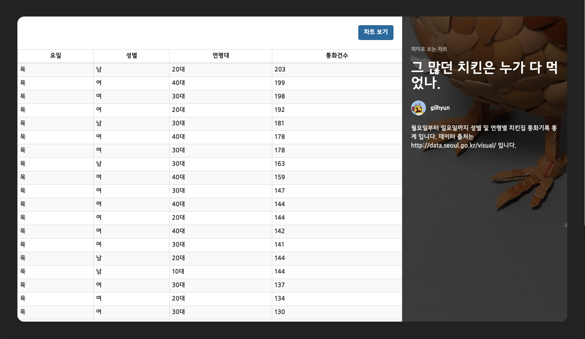

chartlistjs(D3 라이브러리), angularjs, nodejs 등을 이용한 그래프 페이지 예제 입니다.





설치 및 실행
---------------
```bash
# 깃 자장소 복사
$ git clone https://github.com/gilhyun/ChickenChickenChicken
# 복사된 폴더로 이동
$ cd ChickenChickenChicken
# 설치
$ npm install
$ bower install
# 실행
$ node index.js
# 브라우저에서 확인 => http://localhost:8889

```

