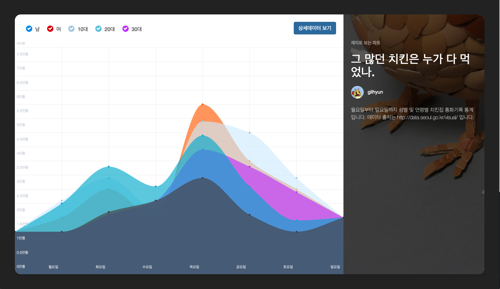

chartlistjs(D3 라이브러리), angularjs, nodejs 등을 이용한 그래프 예제 입니다.




필요사항
---------------
node 와 mongodb 가 작동하는 서버에서 실행 되어야 합니다.


설치 및 실행
---------------
```bash
# 깃 저장소 복제
$ git clone https://github.com/gilhyun/ChickenChickenChicken

# 복제된 폴더로 이동
$ cd ChickenChickenChicken

# 설치
$ npm install
$ bower install

# 서버실행
$ node index.js

# 웹브라우저에서 확인 => http://localhost:8889

```


설정하기
---------------
```bash

# mongodb 디비 설정
.env 파일수정
MONGODB=mongodb://127.0.0.1:27017/디비명

# 시드데이터 넣기: seed.json 가 있는 폴더에서 아래 명령어 실행
$ sudo mongoimport --host=127.0.0.1:27017 --db 디비명 --collection chickenDatas seed.json --jsonArray

```


